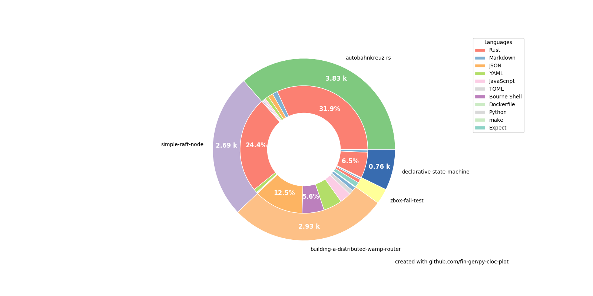

# building-a-distributed-wamp-router

This repository contains research results for github.com/verkehrsministerium/autobahnkreuz-rs

## Projects associated with this work

 - [autobahnkreuz-rs](https://github.com/verkehrsministerium/autobahnkreuz-rs)
 - [simple-raft-node](https://github.com/fin-ger/simple-raft-node)
 - [zbox-fail-test](https://github.com/fin-ger/zbox-fail-test)
 - [declarative-state-machine](https://github.com/fin-ger/declarative-state-machine)

