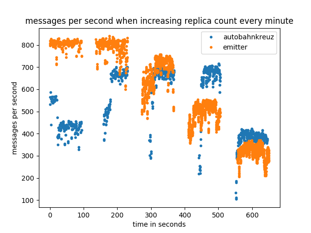

# Introduction

> just out of the top of my head, Work-in-progress...

For modern web pages the importance of realtime data delivery rose during the last years. This created new requirements for web applications where server rendered content was previously used. Technologies like ajax, jsonrpc, socket.io, websockets, and many more arose to fit the needs for realtime data delivery to the web browser. During the same time micro-services got more important in the backend to create scalable and robust applications. Technologies supporting the development of micro-service infrastructures arose like gRPC, captn-proto, Apache Thrift, Java RMI, and many more. As well as the web technologies, the micro-services needed realtime communication between application components on different machines.

In the year 2012 WAMP (Web-Advanced-Messaging-Protocol) appeared as an open and free protocol which combines the requirements of a micro-service infrastructure with modern web technologies, providing a single solution for frontend and backend application development. WAMP requires a central server where all services (backend and frontend) are connected to. The server than routes topic publications and remote procedure calls to these services (clients). The applications built on this technology are implemented as components that are distributed over multiple machines that communicate with each other via WAMP. This can enable an application to be resistant against local machine failures as other machines are still hosting the application on a different location. The reference implementation router (crossbar from crossbar.io Technologies GmbH) runs as a single server instance on a single machine. This introduces a single-point-of-failure to a technology that was designed to be resistant against local machine failures. To counteract this, crossbar.io provides a closed-source commercial router implementation (crossbarFX) that implements a logically central router which is physically distributed over multiple machines. There are other router implementations that also support distributing the routing application over multiple physical machines (like bondy). This paper will describe one possible solution to the problems that implementations for distributed WAMP routing applications have to face. A prototypical implementation was developed during the making of this paper called autobahnkreuz which implements the described solution.

## Web-Application-Messaging-Protocol (WAMP)

The Web-Application-Messaging-Protocol (WAMP) is a web-socket subprotocol built on top of modern web technologies. It implements a publish and subscribe messaging pattern as well as routed remote procedure calls (RPCs). This enables application developers to use a unified interconnect between application components for two different messaging patterns. The protocol is often used in micro-service environments where one application is a minimalistic service for a single responsibility. A distributed application can be created by interconnecting the micro-services. By building on top of web-sockets this enabled web pages inside the web browser to participate as part of the micro-service infrastructure. This makes it considerably easier for a web-page to communicate with the backend in realtime.

# Existing solutions

Comparison to existing solutions.

 * emitter
 * distributed databases
 * distributed filesystems
 * crossbar.io FX enterprise
 * bondy
    * eventual consistency

# Sharing State

 * 3 possibilities
    * distributed database
    * distributed filesystem
    * consensus algorithms

## State of a Router

 * WAMP-Sessions
    * registrations
    * subscriptions
    * transport information

## Data Transport

 * Persistent State
    * subscriptions
    * registrations
    * changes are less often (normally during initialization of a client)
    * must be known at all time on all routers
 * Messages
    * can be very large
    * can be very frequent
    * do not contain state relevant to the router
 * Transmitting messages
    * databases and filesystems
       * state must be changed every time
       * alternative: additional connection between routers
    * consensus algorithms do not specify a transport channel

## Consensus Algorithms

 * raft
    * already implemented in rust
    * easy to understand
    * solves some connection management problems
 * paxos
    * harder to understand
    * not implemented in rust

# Implementing a WAMP-Router

 * raft-rs library from pingcap used
 * raft paper was of great help
 * initializing a cluster
    * not well covered in the paper

## Connection Management

 * `ConnectionManager`
     * establishing connections
 * `Transport`
     * used for communication between the nodes
     * inmemory-channel transport
     * TCP transport

## State Management

 * `Machine`
    * handler object to easily change the state of the node
 * `MachineCore`
    * writes the state to a storage
 * Experiment
    * a declarative state machine using rust's procedural macros

## Storing State

 * `Storage`
    * manages the raft-log
    * appending and reading of the state changes
 * Storage implementations
    * txfs (linux kernel module)
    * zboxfs (userland filesystem)
       * found some bugs and was not stable yet
    * for now the storage is inmemory only
       * is not critical as router state can be restored simply by reconnecting all the clients

## Running a Node

 * `Node`
    * manages all the above components in a single interface
       * `Machine`
       * `ConnectionManager`
       * `Storage`
    * completely thread safe

## Implementing the Protocol

 * forked wampire
 * removed RPCs
 * state of pub/sub synchronized with simple-raft-node

# Deployment

# Evaluation

The availability scenario runs a router with 5 replicas (if horizontal scaling is supported) where 10 clients (nodejs implementation) try to get a connection every second. The router instances are than randomly killed every 30 seconds. The autobahnkreuz router crashes after 10 seconds in the scenario as new members in the routing cluster are accepting connections while not synchronized to the cluster which destabilizes the cluster. The autobahnkreuz implementation fails to provide the expected availability!

The container size scenario checks the size of the latest docker container that is provided by upstream. The lower the container size, the easier the deployment within a cluster orchestrator like kubernetes is (lower than 100 MiB is sufficient for fast deployment).

The high load scenario lets 10 clients publish topics to the other clients as fast as they can. The latency until a topic is signaled as published by the router is messured over time.

The ram usage scenario messures how much memory is consumed by all processes that belong to the routing application while 10 clients are sending a publication every 100 milliseconds.

The scaling-out scenario increases the router instances by one and the client instances by two every minute and messures the overall message throughput per client. The scenario is currently run on a single machine while a more realistic scenario would be to also increase the number of machine with the replica count.

# Conclusion

 * safe async APIs are hard!

# Future Work

 * web-assembly API for router plugins
    * current WAMP-router implementations suffer from too many features
    * error rate rises

# References

