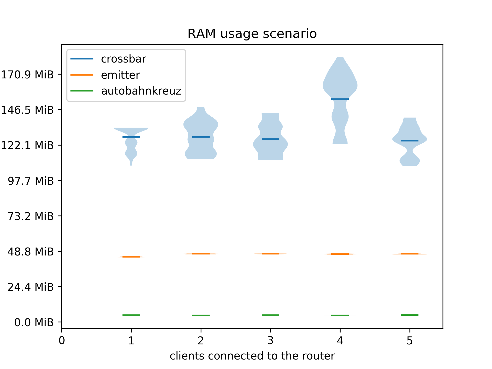
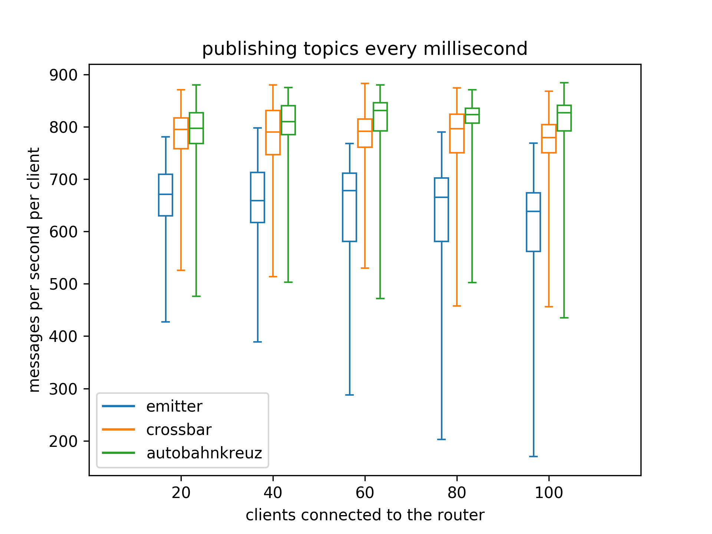

# Introduction

For modern web pages the importance of realtime data delivery rose during the last years. This created new requirements for web applications especially where server rendered content was previously used[@RFC6202]. Technologies like AJAX, JSON-RPC, socket.io, WebSockets, and many more arose to fit the needs for realtime data delivery to the web browser[@Shuang2013ResearchOS]. During the same time micro-services gained importance in the server backend to create scalable and robust applications[@taibi2017processes]. A micro-service is a minimalistic application for a single responsibility. A distributed application can be created by interconnecting the micro-services. Technologies supporting the development of micro-service infrastructures arose like gRPC, Cap'n Proto, Apache Thrift, Java RMI, and many more[@gan2018architectural]. As well as the web technologies, the micro-services needed realtime communication between application components on different machines.

In the year 2012 WAMP (Web-Application-Messaging-Protocol) appeared as an open and free protocol which combines the requirements of a micro-service infrastructure with modern web technologies, providing a single solution for frontend and backend application development[@WAMP:2019]. It implements a publish and subscribe messaging pattern as well as routed remote procedure calls (RPCs). This enables application developers to use a unified interconnect between application components for two different messaging patterns. The protocol was primarily built on top of WebSockets which enables web pages inside the web browser to participate as part of the micro-service infrastructure. This makes it considerably easier for a web-page to communicate with the backend in realtime[@WAMP:2019]. Currently the protocol also supports other transportation layers beside WebSockets, which makes the protocol more flexible in backend application development.

# Limitations of WAMP

WAMP requires a central server where all services (backend and frontend) are connected to. The server then routes topic publications and remote procedure calls to these services (clients). The applications built on this technology are implemented as components that are distributed over multiple machines that communicate with each other via WAMP. This can enable an application to be resistant against local machine failures as other machines are still hosting the application on a different location. The reference implementation router (Crossbar from Crossbar.io Technologies GmbH) runs as a single server instance on a single machine. This introduces a single-point-of-failure to a technology that was designed to be resistant against local machine failures.

Additionally, the routing performance is limited to the execution performance of the single host machine. When the hosts performance is too slow to handle the routing requirements of an application, the only solution is to replace the hardware of the host machine with faster alternatives. This is called scaling-up or vertical scaling. With a distributed routing application it is possible to horizontally scale or scale-out the system. This involves integrating more physical machines into the system, balancing the routing over all machines in the system. This adds an additional possibility for performance scaling to the application.

# A Decentralized WAMP Router

The central problem when implementing a distributed application is sharing the state of one instance of the application to all other instances. One instance in a distributed application is called replica. The state of an application is the data that is needed for the application to define its behavior. When the state of a single application with several replicas gets out-of-sync, the behavior of an individual replica may differ from the behavior of other replicas. This can lead to severe damage of the underlying data, downtimes for the provided services, and even data leaks which may penetrate the security of a server.

## State of a WAMP Router

In a setup where a WAMP router is distributed over multiple machines, the routing information for messages has to be synchronized between the router replicas. The routing information for a WAMP router consists of the following parts:

### Subscriptions

In order for a router replica to decide which client is interested in a published topic, the router needs to synchronize the topic subscriptions for each client over all replicas.

### Registrations

When a client connected to the WAMP router initiates a remote procedure call (RPC), the router replicas must know which client implements the called procedure to route the RPC to the corresponding client. This information is stored in registrations. If a client implements a procedure that can be called remotely, the client registers this procedure in the router.

### Transport Information

As not all clients of a router are connected to the same replica, the replicas must know which replica is connected to which client. This information is used by the router to forward messages to the correct replica, so that a message reaches the desired client.

## Other Implementations

There are existing WAMP router implementations that provide cloud-native functionality. CrossbarFX is a commercial routing application by the Crossbar.io GmbH which provides cloud and large-scale routing for enterprise applications[@CFX:2019]. The router consists of two components: CrossbarFX Edge and CrossbarFX Master. The former provides local routing capabilities and edge application component management. CrossbarFX Master provides large-scale routing by connecting multiple master and edge instances.

Bondy is another open source WAMP routing application written in Erlang that provides horizontal scaling. It is developed by Leapsight and uses the Partisan library for cluster membership management, Plumtree for epidemic broadcasting, and an eventual consistent data store. The application is currently under active development. At this point there exists no release of Bondy.

When not focusing on the WAMP protocol, there exist many cloud-native message routing applications. Emitter is an open source MQTT routing application written in the Go programming language. It uses the Mesh library by Weaveworks to implement a highly available and partition tolerant routing application for the internet of things[@Emitter:2019]. MQTT is a protocol for the publish and subscribe messaging pattern which is heavily used in the internet of things[@karagiannis2015survey]. Emitter uses similar technologies to Bondy and can be used for performance comparisons when investigating publish and subscribe functionalities.

This paper will describe the design and prototypical implementation of the Autobahnkreuz distributed WAMP routing application. The implementation will contain the publish and subscribe messaging pattern of the protocol only. However, the design will take remote procedure calls into consideration to enable the implementation of the complete base profile in a later work. The resulting routing application will be compared to the Crossbar reference implementation and to an existing cloud-native message routing application which implements the MQTT messaging protocol. The deployment size, memory usage, and the message processing latency will be compared as well as the scalability of the service when scaling the routing instances horizontally. 

# Background

A possible solution for sharing the state over multiple replicas is to manage the data outside of the application and let another application handle the state synchronization. There are several applications available that can manage data over multiple machines. Most notably distributed databases, key-value stores, and filesystems.

## Distributed Databases and Key-Value Stores

Databases and key-value stores provide a logically centralized view when accessing the stored data[@ozsu2011principles]. This enables applications to be implemented as stateless services, that ask at the central database for the current state of the application. By storing no state in the application itself, it can be replicated by just starting several instances of the application. This works because all replicas of the application are accessing the application state via the central database. The database implementation is then responsible for distributing the state over multiple machines. There are several distributed databases available that provide exactly this functionality. E.g. Cassandra, Voldemort, Etcd, and TiKV/TiDB[@deka2013survey].

## Distributed Filesystems

A distributed filesystem is a filesystem that runs on multiple machines at the same time. The files available on the filesystem are the same on every machine. When changing the files, the changes take effect on every machine that is part of the distributed filesystem. Distributed filesystems are very good at synchronizing large quantities of data between multiple machines[@levy1990distributed]. Examples are GlusterFS, Ceph, MooseFS, and Lustre[@depardon2013analysis].

## Consensus Algorithms

To prevent state inconsistencies between replicas, consensus algorithms can be used to synchronize data between machines. To change the state in a cluster of multiple machines, a consensus must be reached. This can be implemented by starting an election for a state-change. The machines in the cluster must vote in the election for the state-change. A majority of the machines has to approve the state-change to take effect. Otherwise, the state-change gets rejected and a new election must be started. To prevent elections for every state-change, algorithms exist that install a leader in the cluster which is exclusively granted the right to change the state of the cluster. The leader gets elected by the cluster members when no leader is known by the members. All other members of the cluster enter a follower state, where the state changes of the leader are followed. When a follower receives a request to change the state, it has to forward the state-change to the current leader[@Ongaro:2014].

# Solution Concept

Besides the state needed for the routing, there is other data that must be transferred between router replicas. Publications and procedure calls contain a message body in which parameters and payloads are stored. When forwarding a publication or procedure call to another client, this data must be potentially transferred to another replica. The frequency and size of a topic publication payload can get quite high. Therefore it is undesirable to initiate a state change for publications and RPCs. Instead of routing every publications and RPC over the leader of the cluster, the payload can be transferred directly between the replicas that manage affected clients. This is possible as neither publications nor RPCs contain information that is relevant for the routing.

When clients are connecting to a router, the client's location in the cluster must be synchronized to other replicas. Most clients will then start registering procedures in the router and subscribe for topics. Although it is possible to register and subscribe procedures at any time during an active connection to the router, the majority of messages produced by a client after its initial setup are publications and procedure calls. Therefore state changes are far less frequent when not including publications and procedure calls in the router state.

Distributed filesystems are not well suited to synchronize routing information. The information that is needed for routing is of small size, where distributed filesystems are designed to synchronize huge amounts of data. But more importantly, the routing application would get considerably harder to deploy as for every instance of the WAMP router a distributed filesystem must be set up. This increases the administration overhead and complexity of the deployment. The same applies to distributed databases, where a distributed database instance must be set up for every deployment of a new distributed WAMP router. Additionally, in order to avoid publications and procedure calls to be part of the router state, an additional communication channel must be established between the routers. This increases the complexity when connecting replicas of a router with each other as database connections and peer-to-peer router connections must be managed by the application.

Therefore, it was decided to use a consensus algorithm for synchronizing the routing state between replicas. As consensus algorithms do not specify how the transport channel for communication between replicas should look like, a forwarding channel for publications and procedure calls can be included in the replica interconnect.

## Consensus Algorithms

There exist two major consensus algorithms: Paxos and Raft. In general, Raft is considered easier to understand and provides a more general solution for state synchronization[@Ongaro:2014]. As the goal of this paper is not to implement one of these consensus algorithms but rather use one of them to implement a distributed WAMP routing application, Raft was selected as there already exists an implementation for the Rust programming language called `raft-rs`. The `raft-rs` library is also used in TiKV and TiDB which belong to the Cloud Native Computing Foundation (CNCF). The `raft-rs` library is maintained and developed by PingCAP who also owns TiKV and TiDB. This leads to the decision to use `raft-rs` for state synchronization between WAMP router replicas.

# Implementing a Distributed WAMP-Router

The development of Autobahnkreuz started with implementing the state management between multiple router instances. As the `raft-rs` library implements the Raft consensus algorithm only, the new `simple-raft-node` library was created to extend `raft-rs` with network transport abstractions, state machine management, and log storage writing. During the implementation of `simple-raft-node` the Raft paper was used as a reference for design decisions. The following sections will describe in detail, how the library was implemented.

## Connection Management

In order to establish connections between multiple nodes, the router needs to be able to accept connections from new peers and send Raft messages to specific peers. A `ConnectionManager` trait was added that defines an interface for managing incoming connections and informing the node of new peers. Connections received from a `ConnectionManager` implement the `Transport` trait which enables the sending and receiving of Raft messages. This makes it possible to implement several different physical transports without affecting the node implementation. The connection manager and the transports are used by the node core to implement the communication management which includes the initial handshake for new connections, connecting to new peers of the cluster, and removing nodes which have lost connection to the cluster. The library provides transport implementations for in-memory channels and TCP transports.

The TCP transport implementation is using the `msgpack` serialization format for serializing and deserializing data of a TCP stream. Data that originates in the `raft-rs` library is serialized with Google's Protobuf protocol as the `raft-rs` library provides its own serialization and deserialzation implementation. The transport implementation will buffer all incoming and outgoing messages until they get processed by the node core. This enables the node core to read fully transmitted message objects only, as the implementation will wait until all data belonging to a message object is received. Autobahnkreuz is using the TCP `Transport` and `ConnectionManager` implementations to interconnect router instances. The in-memory channels were only used for testing purposes of the `simple-raft-node` library and are not used in Autobahnkreuz.

## State Management

When new messages from other routers are arriving, they may contain state-change proposals which are processed by the node core. When the node core commits a received state-change proposal, the state machine must apply the state-change to its local state. The `simple-raft-node` library provides two traits for a state machine implementation. The `Machine` trait is used to provide an interface for the user to read and write new states to the machine. The `MachineCore` trait is storing the actual state of the cluster node. When a user requests a write on a `Machine`, the implementation will use a `RequestManager` to send a new state-change proposal to the cluster. The `RequestManager` is provided by the library and is fully thread-safe. All operations on a request manager are asynchronous to prevent users from blocking the current thread while waiting for the Raft to process a possibly long taking state-change proposal. When a proposal succeeds and gets committed to the cluster, the `MachineCore` implementation will be informed about the state-change. As a `MachineCore` is only allowed to be changed when a state-change proposal gets committed, it is owned by the node itself and is not accessible by the user. The user must read and write all states via a `Machine` implementation that works like a handler object to the `MachineCore`. This also allows `Machine` implementations to be freely copied and moved between scopes, as a `Machine` implementation is not holding the machine state. This makes `Machine` implementations thread-safe by design. A `MachineCore` must be serializable and deserialzable to enable snapshots of a state machine. This is used by Raft to limit the log size.

The `simple-raft-node` library provides a hash-map state machine which can be used to implement a distributed key-value store. As an experiment, a declarative approach for specifying a state machine was investigated[^declarative-state-machine]. This approach used Rust's procedural macros to parse a state machine declaration. However, only three lists are necessary to store all subscriptions, registrations, and sessions. Therefore this approach was abandoned. Instead, a `Machine` trait was implemented that enables the modification of the session list, and the subscription list. As Autobahnkreuz is not implementing remote procedure calls, the registration list is not implemented.

## Storing State

When a state-change or cluster configuration change gets processed by the Raft consensus algorithm, a new log entry is produced. The log contains the history of all changes that were applied to the cluster. To prevent retransmitting the whole log when a node is starting up after a failure, the log can be persisted on disk. Storing the log on disk is also needed to prevent data loss when all nodes of a cluster have failed. The `raft-rs` library is proving a `Storage` trait for reading persisted entries from a log. However, it is also necessary to write new entries to disk after they got appended to the log. Therefore, `simple-raft-node` provides its own `Storage` trait that extends the `Storage` trait of `raft-rs` with writing capabilities. With this trait it is possible to easily implement new storage implementations for a Raft node.

When storing the Raft log on disk, it is desirable to have the storage implement ACID properties to prevent the log from getting corrupted on machine failures. However, a corrupted log file can be replaced by resynchronizing it with other cluster members which will create a high network load and a slow response time by the other routers as large amounts of data need to be transferred to the failed cluster member. Implementations for ACID aware storage may rely on transaction based storage mechanisms such as a local database or transaction based filesystems. Transaction based filesystem can be either implemented in the operating system kernel (such as TxFS) or in the userland. During the implementation of Autobahnkreuz, the ZboxFS userland filesystem was evaluated as a storage backend for Raft logs. It was taken into consideration due to the small deployment footprint where no external service needs to be available on the host machine. ZboxFS is used as a library and stores the data on top of any other filesystem. The ACID properties of ZboxFS were tested in a virtual machine environment where machine failures were pragmatically triggered during write operations. The tests revealed issues with the durability of the data stored in ZboxFS, although the source of the issue is not necessarily in ZboxFS itself. It was suggested by the ZboxFS developer that the virtualization environment may introduce the bug[^zbox-bug].

However, for Autobahnkreuz it is sufficient to store all routing information in-memory. This means that the Raft log gets lost when the instance shuts down. When starting a stopped instance up again, the Raft log will be synchronized from other router instances. If there are no other router instances available and all previous state is lost, the clients will reconnect to the routers and resubscribe to topics. However, this behavior is client specific and not enforced by the WAMP protocol, although there are drafts for a session resumption extension to the protocol[@WAMP_session:2019]. As Autobahnkreuz is a prototypical implementation, this restriction is acceptable.

## Running a Node

For easy setup of a distributed state machine, `simple-raft-node` provides a `Node` implementation which uses a `Machine`, a `ConnectionManager`, and a `Storage` to construct a `NodeCore`. The `NodeCore` gets advanced every 100ms where the `ConnectionManager` is checked for new connections, existing connections are checked for new data and liveness, new state-change proposals are passed to the leader of the cluster, and commited state-changes get applied to the storage and machine. When new connections are available, the `NodeCore` will attempt a handshake and eventually insert a new member to the cluster. When connections get unavailable, the corresponding member will get removed from the cluster. As these management tasks may take longer than 100ms, the `NodeCore` keeps track of the execution time of one advance and will postpone processing steps to the next advance cycle if necessary. This ensures the responsiveness of a member regardless of the amount of data that is processed. The `Node` is dispatching a thread during construction of the `NodeCore`. This thread advances the core every 100ms and is managed by the `Node` until the node itself gets destroyed. The `Node` provides thread-safe communication with the core via the `Machine` handle.

In order to join an existing cluster, the node needs a gateway address to connect to. When connecting to the gateway address, the new node will get introduced to the cluster and start synchronizing the state. When the gateway is not available, it is assumed that no cluster exists, yet. The node will create a new cluster instead with itself configured as the leader of the cluster. The deployment has to make sure that new nodes will be able to connect to existing cluster nodes.

Autobahnkreuz was deployed in Kubernetes where a domain name service (DNS) is used to resolve IP addresses of other replicas. Due to a limitation in the deployment, the first replica is always used as the gateway node. When the first replica has a failure resulting in a shutdown of this node, a new replica will not be able to join the cluster, although other replicas are still running and able to serve as a gateway. This limitation can be fixed by using a Kubernetes service domain. The domain will resolve to any active replica, optionally in a round-robin resolution technique. However, Autobahnkreuz is not supporting this gateway method, yet.

## Implementing the Router

The WAMP protocol implementation was taken from an existing WAMP routing application called Wampire. The remote procedure call implementation was removed from the source code, and the state management for subscriptions and sessions was moved to a central instance. A serialization and deserialization based on `msgpack` was implemented for the data objects needed for subscription and session management. To enable the synchronization of this data between multiple nodes, the `Machine` and `MachineCore` traits were implemented. These implementations are passed to a `Node` instance during the startup of the WAMP router enabling state synchronization via the Raft consensus algorithm. Autobahnkreuz is successfully using the `simple-raft-node` library to convert Wampire into a distributed WAMP routing application.

# Validation

## Test Setup

The network setup for Autobahnkreuz is more complex than for other single-node router network setups. To reduce the network administration tasks when deploying an instance of Autobahnkreuz, a Kubernetes deployment was implemented. Kubernetes provides a declarative language for network and configuration setups of docker containers. By using Kubernetes for the network setup, the deployment gets reproducible and scalable. Docker containers are used to isolate the application components from the host operating system. Each docker container has its own root filesystem with its own GNU/Linux distribution. Containers only share the operating system kernel with the host system and other containers. To make communication with other containers possible, filesystem entries and network ports can be exposed by a container[@DOCKER:2019]. For Autobahnkreuz only two TCP ports are exposed.

A process from within a Docker container cannot access data outside the container, unless granted by the administrator. By removing standard GNU/Linux utilities from a container, the attack surface of the deployment gets reduced. This includes removing shells, coreutils, and any other program or library that is not needed to run Autobahnkreuz. This results in a container with some shared libraries and a single executable. The attack surface can be further reduced by statically linking the executable, removing shared libraries like the glibc from the container. As the GNU libc cannot be statically linked, the Musl libc is used instead. This results in a container with only a single executable file. This reduces the possibility of an attacker using preinstalled components in the container to execute scripts or other malicious code. Although this does not eliminate executing malicious code inside the container completely, it makes it harder for an attacker to get code running in the container.

In order to connect all router replicas with each other, the leader tells all other replicas behind which domain or IP each replica is running. Kubernetes uses a domain name service (DNS) to resolve domains inside the cluster for each replica. Additionally, when launching a new replica, these domain names can be used to initiate an initial connection with the cluster. However, during the development of the Kubernetes deployment, a bug[^coredns-bug] was found in the DNS of Kubernetes (coredns). The bug is appearing within the first 30 seconds after startup of a replica. During these 30 seconds, new domain names will sometimes result in `NXDOMAIN` or `REFUSED`. This leads to an unstable startup of new replicas. The bug is reported upstream and confirmed. Autobahnkreuz resolves this issue by issuing DNS lookups until the lookup succeeds.

## Performance

Autobahnkreuz was implemented as a prototypical implementation to prove the feasibility of a distributed WAMP routing application. It was planned to have incomplete WAMP protocol support and expected to be inferior to existing cloud-native routing applications. As of the distributed nature of Autobahnkreuz, the router has the potential to have better performance in environments with many clients as in theory it is capable of distributing the client connections over multiple router replicas. Additionally, the availability of Autobahnkreuz can be higher than a single instance router's availability. If a running Crossbar instance fails, the routing service becomes unavailable until the router is restarted. For Autobahnkreuz other replicas are still able to handle new connections even if one replica has failed. However, active connections of a failed replica cannot be taken over by other replicas in the current state of the Autobahnkreuz implementation.

To compare Autobahnkreuz to existing WAMP routing implementations four scenarios were designed to evaluate the success of the project by comparing it to Crossbar and Emitter. The scenarios take the previously set goals for this project into account. Five virtual machines with two virtual CPU cores with 2.1GHz clock frequency and 8 gigabytes of RAM each were used. A RancherOS with a RKE Kubernetes setup is installed on the nodes. Due to implementation difficulties of the NodeJS test clients, more clients are spawned in the scenarios in favor of running less clients with more publications per second. The cause of the problem is the global interpreter lock of the NodeJS virtual machine which makes it impossible with the current state of the WAMP and MQTT client libraries to use asynchronous websocket operations in an endless loop. As this is not related to the router implementation, it is counteracted by spawning more clients to make the routers process more messages.

### Container Size

The container size is an indicator for the attack surface of a container. The lower the container size, the less dependencies and components of the application can be exploited to execute malicious code inside the container. Additionally, smaller container sizes make a deployment in Kubernetes more stable as the initial setup time of a replica is reduced due to a smaller download size when fetching the container from a container registry. During a failure scenario this helps administrators move the application to other physical machines.

The container size scenario (Figure \ref{containersize}) checks the size of the latest docker container that is provided on the Docker Hub. Docker Hub is a central registry for docker containers. Autobahnkreuz is not using a GNU/Linux distribution at all, instead a single statically linked binary is contained in the container. Emitter's Docker containers are based on a Linux distribution that is not using the GNU tools and instead is using Musl libc and Busybox. Alpine is a focused on security while being a lightweight Linux distribution that is often used for docker deployment due to the small footprint[@ALPINE:2018]. Crossbar's docker containers are based on the Debian GNU/Linux distribution which accounts for the large container size. Crossbar does not include the complete userland of Debian but a trimmed down version called `debian-slim` which omits documentation files and other optional resources when installing new packages.

### RAM Usage

When running multiple instances of a single application inside a cluster environment it is preferable to have a low memory footprint to reduce additional costs associated with the scaling of application instances. The RAM usage scenario (Figure \ref{ramusage}) measures the total memory consumption of all replicas where five replicas of Emitter and Autobahnkreuz were running. Crossbar was running as a single instance as the open source version does not support running replicas. During the scenario up to 100 clients were sending and receiving topic publications every millisecond. The scenario begins with 20 clients and increases the amount of connected clients every five minutes by 20 clients. Autobahnkreuz shows the lowest memory consumption, which was expected as Rust uses manual memory management without a garbage collection. Emitter is written in the Go programming language and therefore uses a garbage collection for memory management. The highest memory consumption is observed from Crossbar. Crossbar is written in Python where the source code has to be interpreted at runtime. Therefore the memory consumption is considerably higher. All routers show no impact on the memory consumption when increasing the amount of connected clients.

### High Message Throughput

The high message throughput scenario (Figure \ref{highload}) measures whether clients can keep up sending a publication every millisecond when increasing the client count. The client count is increased by 20 clients every five minutes and starts with 20 clients and ends with 100 clients. The clients check whether a publication got marked as published by the router. For all clients, a NodeJS test implementation was used. However, as Emitter does not implement the WAMP protocol, another client library (`mqtt-js`) was used to communicate with the router. The WAMP test implementation uses the `kraftfahrstrasse` client library.

By using a programming language that is compiling to native code, Autobahnkreuz counteracts the drawbacks of running in a replicated setup when compared to Crossbar. The source for the higher latency of publication responses in Emitter can be due to the use of a different client library implementation. When increasing the amount of connected clients, Emitter shows a greater variance for the message throughput per client where the other routers show no impact on the message throughput.

### Scaling-Out

 chapter.\label{scalingout}](../scenarios/scaling-out/plots/2019-07-31T13:18:05+02:00-scenario-scaling-out.png)

Distributed applications are often scaled horizontally to increase the number of requests that can be handled by the system. The scaling-out scenario (Figure \ref{scalingout}) measures how many topic publications a client can send each second when trying to publish a topic every millisecond. The test starts with 100 clients and a single routing replica running and increases by two routing replicas every five minutes.

The scenario shows that Autobahnkreuz is able to scale with the number of routers as long as there are no more routing instances than physical machines. Emitter shows slightly worse performance when increasing the replica count as the lower boundary of the variance drops. This shows that emitter is not scaling in this scenario. A higher message density was not tested, however a scenario where each client emits more publications per second may still reveal working horizontal scaling for Emitter.

# Conclusion

The whole project gave great insight into the challenges involved in developing a distributed application. By studying the Raft paper and existing implementations that are using the Raft consensus algorithm (Etcd and TiKV), a lot of design decisions for Autobahnkreuz were pointed into the right direction. The abstraction interfaces of `simple-raft-node` turned out to work very well. The integration of these interfaces into existing code (Wampire, ZBoxFS, and TCP streams) was not a problem. However, the design and implementation of asynchronous APIs for `simple-raft-node` was more complicated than expected. Several redesigns of the implementation were necessary to create a working interface. The main problem in the asynchronous API design was assigning ownerships to the data. The result is the `Machine` handler object which ensures safe access to the state-machine from any thread. Although, asynchronous programming in Rust is still not included in a stable release of the compiler, the integration of asynchronous tasks in Autobahnkreuz went flawlessly.

The deployment of Autobahnkreuz using Kubernetes turned out to be the right choice, as strategies for deploying a distributed application inside Kubernetes are well explained in the documentation. Getting a deployment of Autobahnkreuz running inside a Kubernetes cluster turned out to be no big challenge. In the end, Autobahnkreuz performed surprisingly well when compared to other routing implementations. Although, the router is failing to provide the expected availability, it performs well in all other scenarios.

The project is considered to be a success. The complete source code of this work is available as open source software on Github[^autobahnkreuz][^simple-raft-node].

# Future Work

It is planned to continue the development of the Autobahnkreuz routing application. The development will focus on fixing the avail1ability issue described in this work and completing the WAMP base profile by supporting remote procedure call routing. Additionally, the connection management algorithms of the `simple-raft-node` library can be moved to a new library, making the reuse of this code easier in other projects.

For real-world applications, the WAMP specification includes extensions to the protocol which introduce new mechanisms and APIs besides the publish/subscribe and remote procedure call messaging patterns. This makes the existing routing applications very complex and hard to maintain. To counteract this, all extensions to the base WAMP profile can be implemented as plugins to the router. A plugin API for a distributed application where the plugins have to manage their state over multiple machines can be designed as a follow-up work. Autobahnkreuz would then be capable of serving subsets of the advanced WAMP profile on demand. This is especially beneficial for a distributed routing application as only the state of WAMP features which the user is actually using must to be synchronized between router replicas. This can lower the amount of data that is synchronized in the cluster for a specific micro-service application.

# References

[^declarative-state-machine]: [https://github.com/fin-ger/declarative-state-machine](https://github.com/fin-ger/declarative-state-machine)
[^zbox-bug]: [https://github.com/zboxfs/zbox/issues/36](https://github.com/zboxfs/zbox/issues/36)
[^coredns-bug]: [https://github.com/kubernetes/kubernetes/issues/78128](https://github.com/kubernetes/kubernetes/issues/78128)
[^autobahnkreuz]: [https://github.com/verkehrsministerium/autobahnkreuz-rs](https://github.com/verkehrsministerium/autobahnkreuz-rs)
[^simple-raft-node]: [https://github.com/fin-ger/simple-raft-node](https://github.com/fin-ger/simple-raft-node)
