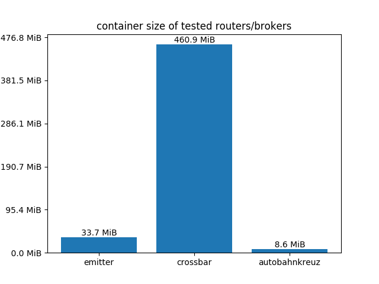
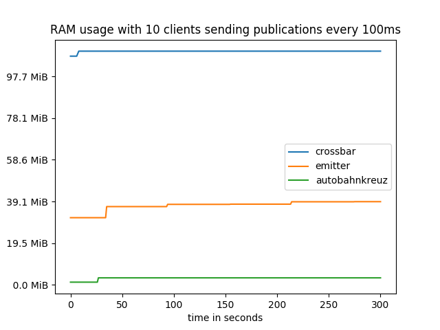
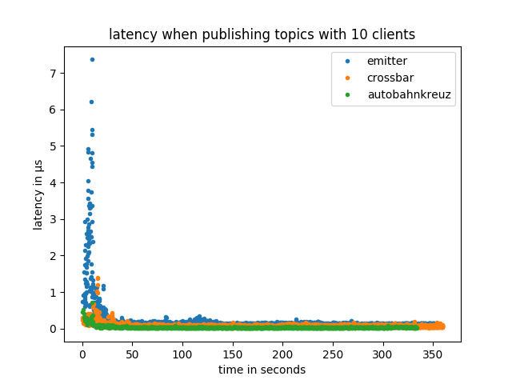
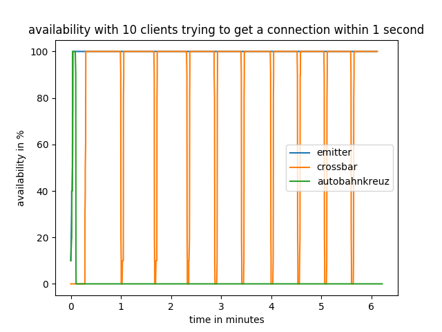
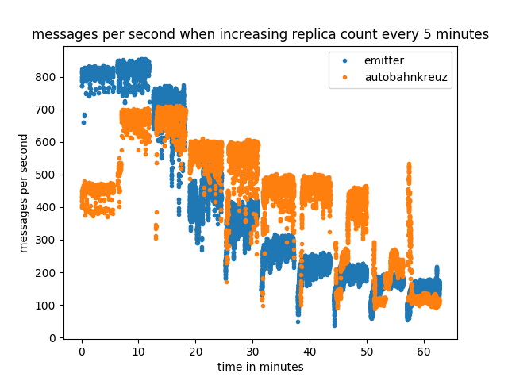

# Introduction

For modern web pages the importance of realtime data delivery rose during the last years. This created new requirements for web applications where server rendered content was previously used. Technologies like ajax, jsonrpc, socket.io, websockets, and many more arose to fit the needs for realtime data delivery to the web browser. During the same time micro-services got more important in the backend to create scalable and robust applications. A micro-service is a minimalistic application for a single responsibility. A distributed application can be created by interconnecting the micro-services. Technologies supporting the development of micro-service infrastructures arose like gRPC, captn-proto, Apache Thrift, Java RMI, and many more. As well as the web technologies, the micro-services needed realtime communication between application components on different machines.

In the year 2012 WAMP (Web-Advanced-Messaging-Protocol) appeared as an open and free protocol which combines the requirements of a micro-service infrastructure with modern web technologies, providing a single solution for frontend and backend application development. It implements a publish and subscribe messaging pattern as well as routed remote procedure calls (RPCs). This enables application developers to use a unified interconnect between application components for two different messaging patterns. The protocol was primarily built on top of web-sockets which enables web pages inside the web browser to participate as part of the micro-service infrastructure. This makes it considerably easier for a web-page to communicate with the backend in realtime. Currently the protocol also supports other transportation layers beside web-sockets, which makes the protocol more flexible in backend application development. 

WAMP requires a central server where all services (backend and frontend) are connected to. The server than routes topic publications and remote procedure calls to these services (clients). The applications built on this technology are implemented as components that are distributed over multiple machines that communicate with each other via WAMP. This can enable an application to be resistant against local machine failures as other machines are still hosting the application on a different location. The reference implementation router (crossbar from crossbar.io Technologies GmbH) runs as a single server instance on a single machine. This introduces a single-point-of-failure to a technology that was designed to be resistant against local machine failures. To counteract this, crossbar.io provides a closed-source commercial router implementation (crossbarFX) that implements a logically central router which is physically distributed over multiple machines. There are other router implementations that also support distributing the routing application over multiple physical machines (like bondy).

This paper will describe one possible solution to the problems that implementations for distributed WAMP routing applications have to face. A prototypical implementation was developed during the making of this paper called autobahnkreuz which implements the described solution.

# Sharing State

The central problem when implementing a distributed application is sharing the state of one instance of the application (replica) to all other replicas. The state of an application is the data that is needed for the application to define its behavior. When the state of a single application with several replicas gets out of sync, the behavior of an individual replica may differ from the behavior of other replicas. This can lead to severe damage of the underlying data, downtimes for the provided services, and even data leaks which may penetrate the security of a server.

## Existing Solutions

A possible solution to this problem is to manage the data outside of the application and let another application handle the state synchronization. There are several applications available that can manage data over multiple machines. Most notably distributed databases, key-value stores and filesystems.

### Distributed Databases and Key-Value Stores

Databases and key-value stores provide a logically centralized view when accessing the stored data. This enables applications to be implemented as stateless services, that ask at the central database for the current state of the application. By storing no state in the application itself, it can be replicated by just starting several instances of the application. This works because all replicas of the application are accessing the application state via the central database. The database implementation is then responsible for distributing the state over multiple machines. There are several distributed databases available that provide exactly this functionality. E.g. PostgreSQL, MariaDB, etcd, and TiKV/TiDB.

### Distributed Filesystems

A distributed filesystem is a filesystem that runs on multiple machines at the same time. The files available on the filesystem are the same on every machine. When changing the files, the changes take effect on every machine that is part of the distributed filesystem. Distributed filesystems are very good at synchronizing large quantities of data between multiple machines. Examples are GlusterFS, Ceph, BeeGFS, HDFS, and AFS.

### Consensus Algorithms

To prevent state inconsistencies between replicas, consensus algorithms can be used to synchronize data between machines, after a consensus is reached about a state change. This can be implemented by starting an election for a state change. The machines in the cluster must vote in the election for the state change. A majority of the machines has to approve the state change to take effect. Otherwise, the state change gets rejected and a new election must be started. To prevent elections for every state change, algorithms exist that install a leader in the cluster which is exclusively granted the right to change the state of the cluster. The leader gets elected by the cluster members when no leader is known by the members. All other members of the cluster enter a follower state, where the state changes of the leader are followed. When a follower receives a request to change the state, it has to forward the state change to the current leader.

## Other Implementations

There are existing WAMP router implementations that provide cloud-native functionality. Crossbar.io FX is a commercial routing application by Crossbar.io GmbH which provides cloud and large-scale routing for enterprise applications. The router consists of two components: Crossbar FX Edge and Crossbar FX Master. The former provides local routing capabilities and edge application component management. Crossbar FX Master provides large-scale routing by connecting multiple master and edge instances.

Bondy is another open source WAMP routing application written in Erlang that provides horizontal scaling. It is developed by Leapsight and uses Partisan for cluster membership management, Plumtree for epidemic broadcasting, and an eventual consistent data store. The application is currently under active development. At this point there exists no release of Bondy.

When not focusing on the WAMP protocol, there exist many cloud-native message routing applications. Emitter is an open source MQTT routing application written in the Go programming language. It uses the mesh library by Weaveworks to implement a highly available and partition tolerant routing application for the internet of things. MQTT is a protocol for the publish and subscribe messaging pattern which is heavily used in the internet of things. Emitter uses similar technologies to Bondy and can be used for performance comparisons when investigating publish and subscribe functionalities.

## State of a Router

In a setup where a WAMP router is distributed over multiple machines, the routing information for messages has to synchronized between the router replicas. The routing information for a WAMP router consists of the following parts:

### Subscriptions

In order for a router replica to decide which client is interested in a published topic, the router needs to synchronize the topic subscriptions for each client over all replicas.

### Registrations

When a client connected to the WAMP router initiates a remote procedure call (RPC), the router replicas must know which client implements the called procedure to route the RPC to the corresponding client. This information is stored in registrations. If a client implements a procedure that can be called remotely, the client registers this procedure in the router.

### Transport Information

As not all clients of a router are connected to the same replica, the replicas must know which replica is connected with which client. This information is used by the router to forward messages to the correct replica, so that a message reaches the desired client.

## Data Transport

Besides the state needed for the routing there is other data that must be transferred between router replicas. Publications and procedure calls contain a message body in which parameters and payloads are stored. When forwarding a publication or procedure call to another client, this data must be potentially transferred to another replica. The frequency and size of a topic publication payload can get quite high. Therefore it is undesirable to initiate a state change for publications and RPCs. Instead of routing every publications and RPC over the leader of the cluster, the payload can be transferred directly between the replicas that manage affected clients. This is possible as neither publications nor RPCs contain information that is relevant for the routing.

When clients are connecting to a router, the clients location in the cluster must be synchronized to other replicas. Most clients will then start registering procedures in the router and subscribe for topics. Although it is possible to register and subscribe procedures any time during an active connection to the router, the majority of messages produced by a client after its initial setup are publications and procedure calls. Therefore state changes are far less frequent when not including publications and procedure calls in the router state.

Distributed filesystems are not well suited to synchronize routing information. The information that is needed for routing is of small size, where distributed filesystems are designed to synchronize huge amounts of data. But more importantly, the routing application would get considerably harder to deploy as for every instance of the WAMP router a distributed filesystem must be set up. This increases the administration overhead and complexity of the deployment. The same applies to distributed databases, where a distributed database instance must be set up for every instance of a new WAMP router. Additionally, in order to avoid publications and procedure calls to be part of the router state, an additional communication channel must be established between the routers. This increases the complexity when connecting replicas of a router with each other as database connections and peer-to-peer router connections must be managed by the application.

Therefore, it was decided to use a consensus algorithm for synchronizing the routing state between replicas. As consensus algorithms do not specify how the transport channel for communication between replicas should look like, a forwarding channel for publications and procedure calls can be included in the replica interconnect.

## Consensus Algorithms

There exist two major consensus algorithms: Paxos and Raft. In general, raft is considered easier to understand and provides a more general solution for state synchronization. As the goal of this paper is not to implement one of these consensus algorithms but rather use one of them to implement a distributed WAMP routing application, Raft was selected as there already exists an implementation for the Rust programming language called `raft-rs`. The `raft-rs` library is also used in TiKV and TiDB which are part of the Cloud Native Computing Foundation (CNCF). The `raft-rs` library is maintained and developed by Pingcap who also own TiKV and TiDB. This leads to the decision to use `raft-rs` for state synchronization between WAMP router replicas.

# Implementing a Distributed WAMP-Router

The development of Autobahnkreuz started with implementing the state management between multiple router instances. As the `raft-rs` library which is developed by PingCAP implements the Raft consensus algorithm only, the new `simple-raft-node` library was created to extend `raft-rs` with network transport abstractions, state machine management, and log storage writing. PingCAP is the developer of the horizontal scalable, cloud-native, highly available TiDB database system. During the implementation of `simple-raft-node` the Raft paper was used as a reference for design decisions. The following sections will describe in detail, how the library was implemented.

 * initializing a cluster
    * not well covered in the paper

## Connection Management

In order to establish connections between multiple nodes, the router needs to be able to accept connections from new peers and send Raft messages to specific peers. A `ConnectionManager` trait was added that manages incoming connections and informs the node if a new peer is available. Connections received from a `ConnectionManager` implement the `Transport` trait which enables sending and receiving of Raft messages. This makes it possible to implement several different physical transports without affecting the node implementation. The connection manager and the transports are used by the node core to implement the communication management which includes the initial handshake for new connections, connecting to new peers of the cluster, and removing nodes which lost connection from the cluster. The library provides transport implementations for in-memory channels and TCP transports.

The TCP transport implementation is using the `msgpack` serialization format for serializing and deserializing data of a TCP stream. Data that originates in the `raft-rs` library is serialized with Google's Protobuf protocol as the `raft-rs` library provides its own serialization and deserialzation implementation. The transport implementation will buffer all incoming and outgoing messages until they get processed by the node core. This enables the node core to read fully transmitted message objects only, as the implementation will wait until all data belonging to a message object was received. Autobahnkreuz is using the TCP `Transport` and `ConnectionManager` implementations to interconnect router instances. The in-memory channels were only used for testing purposes of the `simple-raft-node` library and are not used in Autobahnkreuz.

## State Management

When new message from other routers are arriving, they may contain state-change-proposals which are processed by the node core. When the node core commits a received state-change-proposal, the state machine must apply the state-change to its local state. The `simple-raft-node` library provides two traits for a state machine implementation. The `Machine` trait is used to provide an interface for the user to read and write new states to the machine. The `MachineCore` trait is storing the actual state of the cluster node. When a user requests a write on a `Machine`, the implementation will use a `RequestManager` to send a new state-change-proposal to the cluster. The `RequestManager` is provided by the library and is fully thread-safe. All operations on a request manager are asynchronous to prevent users from blocking the current thread while waiting for the Raft to process a possibly long taking state-change-proposal. When a proposal succeeds and gets committed to the cluster, the `MachineCore` implementation will be informed about the state-change. As a `MachineCore` is only allowed to be changed when a state-change-proposal gets committed, it is owned by the node itself and is not accessible by the user. The user must read and write all states via a `Machine` implementation that works like a handler object to the `MachineCore`. This also allows `Machine` implementations to be freely copied and moved between scopes, as a `Machine` is not holding the machine state. This makes `Machine` implementations thread-safe by design. A `MachineCore` must be serializable and deserialzable to enable shapshotting of a state machine. This is used by Raft to limit the log size.

The `simple-raft-node` library provides a hashmap state machine which can be used to implement a distributed key-value store. As an experiment, a declarative approach for specifying a state machine was investigated. This approach used Rust's procedural macros to parse a state machine declaration. However, as Autobahnkreuz is only using a three lists to store all subscriptions, registrations, and sessions, this approach was abandoned. Instead, a `Machine` trait was implemented that enables the modification of the session list, and the subscription list. As Autobahnkreuz is not implementing remote procedure calls, the registration list is not implemented.

## Storing State

When a state-change or membership change gets processed by the Raft consensus algorithm, a new log entry is produced. The log contains the history of all changes that were applied to the cluster. To prevent retransmitting the whole log when a node is starting up after a failure, the log can be persisted on disk. Storing the log in disk is also needed to prevent data loss when all nodes of a cluster have failed. The `raft-rs` library is proving a `Storage` trait for reading persisted entries from a log. However, it is also necessary to write new entries to disk after they got appended to the log. Therefore, `simple-raft-node` provides its own `Storage` trait that extends the `Storage` trait of `raft-rs` with writing capabilities. With this trait it is possible to easily implement new storage implementations for a Raft node.

 * Storage implementations
    * txfs (linux kernel module)
    * zboxfs (userland filesystem)
       * found some bugs and was not stable yet
    * for now the storage is inmemory only
       * is not critical as router state can be restored simply by reconnecting all the clients

## Running a Node

 * `Node`
    * manages all the above components in a single interface
       * `Machine`
       * `ConnectionManager`
       * `Storage`
    * completely thread safe
    * dispatches `NodeCore` to a thread and manages the thread until the end of its lifetime
    * `NodeCore` is advanced every 100ms
    * A gateway is used to initially join the cluster
    * Gateway is a resource identifier like IP Address or domain name with a TCP port
    * The gateway currently requires the network interface serving the node interconnect to be the same as the gateway address for initially booting the cluster. The first node will compare its own interface address with the gateway address and if they match, a new cluster will be created with the current node set to the leader.
    * other approaches for managing nodes in a cluster
       * dns lookup to the service domain results in all Pod IPs that belong to the service
       * this is only available when a kubernetes service is configured to `ClusterIP: none`.
 * `NodeCore`
    * fetches incoming connection from the connection manager and handles connection setup (Hello/Welcome)
    * fetches new messages from other members of the cluster for processing
    * state change proposals are collected
    * forwards proposals to the leader if the leader is not me
    * processes proposals on the raft and state machine
    * applies changes from the raft
    * handles membership changes
    * applies committed state changes to the underlying state machine
    * manages a timeout for one computation cycle to ensure responsiveness of a node

## Implementing the Protocol

 * forked wampire
 * removed RPCs
 * state of pub/sub synchronized with simple-raft-node

# Deployment

The network setup for `autobahnkreuz` is more complex than other single-node router network setups. To reduce the network administration tasks when deploying an instance of Autobahnkreuz, a Kubernetes deployment was implemented. Kubernetes provides a declarative language for network and configuration setups of docker containers. By using Kubernetes for the network setup, the deployment gets reproducible and scalable. Docker containers are used to isolate the application components from the host operating system. Each docker container has its own root filesystem with its own GNU/Linux distribution. Containers only share the operating system kernel with the host system and other containers. To make communication with other containers possible, filesystem entries and network ports can be exposed by a container. For Autobahnkreuz only two TCP ports are exposed.

A process from within a Docker container cannot access data outside the container, unless granted by the administrator. By removing standard GNU/Linux utilities from a container, the attack surface of the deployment gets reduced. This includes removing shells, coreutils, and any other program or library that is not needed to run Autobahnkreuz. This results in a container with some shared libraries and a single executable. The attack surface can be further reduced by statically linking the executable, removing shared libraries like the glibc from the container. As the GNU libc cannot be statically linked, the Musl libc is used instead. Now, the container only contains a single executable file. This reduces the possibility of an attacker using preinstalled components in the container to execute scripts or other malicious code. Although this does not eliminate executing malicious code in the container completely, it makes it harder for an attacker to get code running in the container.

In order to connect all router replicas with each other, the leader tells all other replicas behind which domain or IP each replica is running. Kubernetes uses a domain name service (DNS) to resolve domains inside the cluster for each replica. Additionally, when launching a new replica, these domain names can be used to initiate an initial connection with the cluster. However, during the development of the Kubernetes deployment, a bug was found in the DNS of Kubernetes (coredns). The bug is appearing within the first 30 seconds after startup of a replica. During these 30 seconds, new domain names will sometimes result in `NXDOMAIN` or `REFUSED`. This leads to an unstable startup of new replicas. The bug is reported upstream and confirmed. Autobahnkreuz resolves this issue by issuing DNS lookups until the lookup succeeds.

# Evaluation

Autobahnkreuz was implemented as a prototypical implementation to prove the feasibility of a distributed WAMP routing application. It was expected to have bugs and incomplete WAMP protocol support. However, it is still valuable to compare Autobahnkreuz to existing routing applications. Therefore five scenarios were designed to evaluate the success of this project. The tests were run in a `k3s` setup in a VirtualBox machine with 8 gigabytes of RAM and one CPU core. The virtual machine was running on an Intel Core i7-6700HQ host CPU.

## Container Size

The container size is an indicator for the attack surface of a container. The lower the container size, the less dependencies and components of the application can be exploited to execute malicious code inside the container. Additionally, smaller container sizes make a deployment in Kubernetes more stable as the initial setup time of a replica is reduced due to a smaller download size when fetching the container from a container registry. During a failure scenario this helps administrators move the application to other physical machines.

The container size scenario (Figure \ref{container-size}) checks the size of the latest docker container that is provided on the Docker Hub. Docker Hub is a central registry for docker containers. Autobahnkreuz is not using a GNU/Linux distribution at all, instead a single statically linked binary is contained in the container. Emitter's Docker containers are based on a Linux distribution that is not using the GNU tools and instead is using Musl libc and Busybox. Alpine is a "security-oriented, lightweight Linux distribution" that is often used for docker deployment due to the small footprint. Crossbar's docker containers are based on the Debian GNU/Linux distribution which accounts for the large container size. Crossbar does not include the complete userland of Debian but a trimmed down version called `debian-slim` which omits documentation files and other optional resources.

## RAM Usage

When running multiple instances of a single application inside a cluster environment it is preferable to have a low memory footprint to reduce additional costs associated with the scaling of application instances. The RAM usage scenario (Figure \ref{ram-usage}) measures the total memory consumption of all replicas where five replicas of Emitter and Autobahnkreuz were running. Crossbar was running as a single instance as the open source version does not support running replicas. During the scenario 10 clients were sending and receiving topic publications every 100 milliseconds. Autobahnkreuz shows the lowest memory consumption, which was expected as Rust uses manual memory management with a garbage collection. Emitter is written in the Go programming language and therefore uses a garbage collection for memory management. The highest memory consumption is observed from Crossbar. Crossbar is written in Python where the source code has to be interpreted at runtime. Therefore the memory consumption is considerably higher.

## High Message Throughput

The high message throughput scenario (Figure \ref{high-load}) measures the latency until a publication is signaled as published by the router. This scenario therefore includes the latency of the client library implementation when publishing a topic. The scenario lets 10 clients publish topics to all other clients as fast as they can. This means, a new publication is sent as soon as the router signals the previous publication as published. For all clients, a NodeJS test implementation was used. However, as Emitter does not implement the WAMP protocol, another client library (`mqtt-js`) was used to communicate with the router. The WAMP test implementation uses the `kraftfahrstrasse` client library.

A higher latency for topic publications is expected from routers running in replicated setups as messages may get routed to other physical machines. However, Autobahnkreuz has about the same response time as Crossbar. By using a programming language that is compiling to native code, Autobahnkreuz counteracts the drawbacks of running in a replicated setup when compared to Crossbar. The source for the higher latency of publication responses in Emitter can be due to the use of a different client library implementation.

## Availability

When running a distributed application inside a cluster setup, failures of single replicas should not affect the availability of the provided service as other replicas can take over the traffic of the failed node. The cluster orchestrator can then launch a new replica to replace the failed one. The availability scenario (Figure \ref{availability}) tests if the routing service stays available if replicas are failing. For this scenario, routers that support replication were running with five replicas. To check the availability, 10 clients are each trying to connect to the router every second. The test kills a random replica every 30 seconds and waits until the deletion of the replica has finished.

Emitter is handling the replica failures flawlessly, while Crossbar is unavailable every 30 seconds. This is expected as Crossbar is running as a single application instance. Autobahnkreuz however crashes after 10 seconds into the test as new members in the routing cluster are accepting connections while not synchronized to the cluster. This destabilizes the cluster and causes the replicas to fail. The orchestration framework tries to restart the failed replicas but new replicas are unable to join the cluster as existing replicas do not contain a consistent state. The autobahnkreuz implementation fails to provide the expected availability! As this bug is caused by a misbehaving implementation and has not its cause in the design of the router, it can be fixed by checking the progress of the synchronization of new replicas. Additionally, a readiness probe must be installed to inform Kubernetes about the ability of a replica to accept connections.

## Scaling-Out

> TODO: run on multiple machines

Distributed applications are often scaled to increase the number of requests that can be handled by the system. The scaling-out scenario (Figure \ref{scaling-out}) tests how many topics can be published per second on every client. The test starts running with two clients and a single routing replica and increases by one routing replica and two clients every five minutes. The scenario is currently run on a single machine while a more realistic scenario would be to also increase the number of machines with the replica count.

# Conclusion

 * safe async APIs are hard!
 * deployment was right choice
 * async networking in Rust is not finished yet

# Future Work

 * web-assembly API for router plugins
    * current WAMP-router implementations suffer from too many features
    * error rate rises
 * fix the availability bug in Autobahnkreuz

# References

