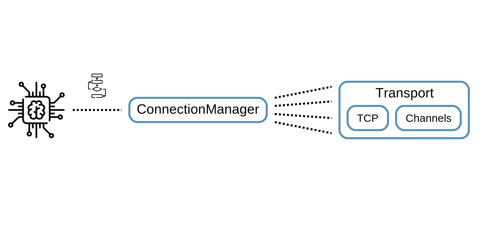
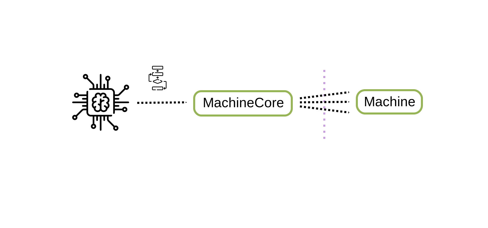
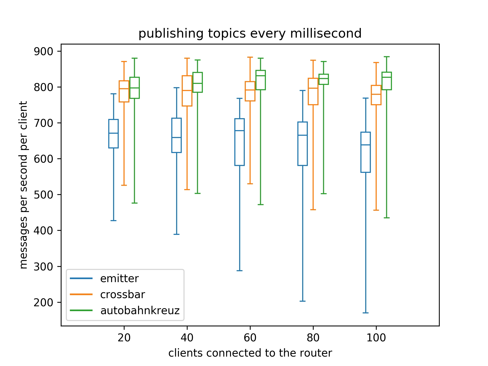

# Prototyp eines verteilten Cloud-Native WAMP-Routers
## Wissenschaftliches Individualprojekt

<small>
  WAMP-Logo by
  <a href="http://crossbario.com/"
     title="Crossbar.io Technologies GmbH">Crossbar.io Technologies GmbH</a>
  is licensed under
  <a href="http://creativecommons.org/licenses/by-sa/3.0/"
     title="Creative Commons BY-SA 3.0">CC BY-SA 3.0</a>
</small>

----

# I. Introduction
## What is WAMP?

<small>
  Icons made by
  <a href="https://www.flaticon.com/authors/freepik" title="Freepik">Freepik</a>,
  <a href="https://www.flaticon.com/authors/smashicons" title="Smashicons">Smashicons</a>
  from
  <a href="https://www.flaticon.com/" title="Flaticon">www.flaticon.com</a>
  are licensed by
  <a href="http://creativecommons.org/licenses/by/3.0/" title="Creative Commons BY 3.0">CC 3.0 BY</a>
</small>

----

# II. Limitations of WAMP
## Centralized routing

<small>
  Icons made by
  <a href="https://www.flaticon.com/authors/freepik" title="Freepik">Freepik</a>,
  <a href="https://www.flaticon.com/authors/smashicons" title="Smashicons">Smashicons</a>
  from
  <a href="https://www.flaticon.com/" title="Flaticon">www.flaticon.com</a>
  are licensed by
  <a href="http://creativecommons.org/licenses/by/3.0/" title="Creative Commons BY 3.0">CC 3.0 BY</a>
</small>

----

# III. A Decentralized WAMP Router
## State of a WAMP Router

<small>
  Icons made by
  <a href="https://www.flaticon.com/authors/freepik" title="Freepik">Freepik</a>,
  <a href="https://www.flaticon.com/authors/smashicons" title="Smashicons">Smashicons</a>
  from
  <a href="https://www.flaticon.com/" title="Flaticon">www.flaticon.com</a>
  are licensed by
  <a href="http://creativecommons.org/licenses/by/3.0/" title="Creative Commons BY 3.0">CC 3.0 BY</a>
</small>

----

# IV. Background
## Sharing State

<small>
  Icons made by
  <a href="https://www.flaticon.com/authors/freepik" title="Freepik">Freepik</a>,
  <a href="https://www.flaticon.com/authors/smashicons" title="Smashicons">Smashicons</a>,
  <a href="https://www.flaticon.com/authors/prettycons" title="prettycons">prettycons</a>
  from
  <a href="https://www.flaticon.com/" title="Flaticon">www.flaticon.com</a>
  are licensed by
  <a href="http://creativecommons.org/licenses/by/3.0/" title="Creative Commons BY 3.0">CC 3.0 BY</a>
</small>

----

# V. Solution Concept
## Replica Communication / Databases and Filesystems

<small>
  Icons made by
  <a href="https://www.flaticon.com/authors/freepik" title="Freepik">Freepik</a>,
  <a href="https://www.flaticon.com/authors/smashicons" title="Smashicons">Smashicons</a>,
  <a href="https://www.flaticon.com/authors/prettycons" title="prettycons">prettycons</a>
  from
  <a href="https://www.flaticon.com/" title="Flaticon">www.flaticon.com</a>
  are licensed by
  <a href="http://creativecommons.org/licenses/by/3.0/" title="Creative Commons BY 3.0">CC 3.0 BY</a>
</small>

----

# V. Solution Concept
## Replica Communication / Consensus Algorithm

<small>
  Icons made by
  <a href="https://www.flaticon.com/authors/freepik" title="Freepik">Freepik</a>
  from
  <a href="https://www.flaticon.com/" title="Flaticon">www.flaticon.com</a>
  are licensed by
  <a href="http://creativecommons.org/licenses/by/3.0/" title="Creative Commons BY 3.0">CC 3.0 BY</a>
</small>

---

# Implementing A Distributed WAMP-Router
## Developing the Autobahnkreuz WAMP-Router

----

# VI. Implementing A Distributed WAMP-Router
## Connection Management

<small>
  Icons made by
  <a href="https://www.flaticon.com/authors/freepik" title="Freepik">Freepik</a>
  from
  <a href="https://www.flaticon.com/" title="Flaticon">www.flaticon.com</a>
  are licensed by
  <a href="http://creativecommons.org/licenses/by/3.0/" title="Creative Commons BY 3.0">CC 3.0 BY</a>
</small>

----

# VI. Implementing A Distributed WAMP-Router
## State Management

<small>
  Icons made by
  <a href="https://www.flaticon.com/authors/freepik" title="Freepik">Freepik</a>
  from
  <a href="https://www.flaticon.com/" title="Flaticon">www.flaticon.com</a>
  are licensed by
  <a href="http://creativecommons.org/licenses/by/3.0/" title="Creative Commons BY 3.0">CC 3.0 BY</a>
</small>

----

# VI. Implementing A Distributed WAMP-Router
## Storing State

<small>
  Icons made by
  <a href="https://www.flaticon.com/authors/freepik" title="Freepik">Freepik</a>
  from
  <a href="https://www.flaticon.com/" title="Flaticon">www.flaticon.com</a>
  are licensed by
  <a href="http://creativecommons.org/licenses/by/3.0/" title="Creative Commons BY 3.0">CC 3.0 BY</a>
</small>

----

# VI. Implementing A Distributed WAMP-Router
## Running a Node

<small>
  Icons made by
  <a href="https://www.flaticon.com/authors/freepik" title="Freepik">Freepik</a>
  from
  <a href="https://www.flaticon.com/" title="Flaticon">www.flaticon.com</a>
  are licensed by
  <a href="http://creativecommons.org/licenses/by/3.0/" title="Creative Commons BY 3.0">CC 3.0 BY</a>
</small>

----

# VI. Implementing A Distributed WAMP-Router
## Implementing the Router

<small>
  Icons made by
  <a href="https://www.flaticon.com/authors/freepik" title="Freepik">Freepik</a>
  from
  <a href="https://www.flaticon.com/" title="Flaticon">www.flaticon.com</a>
  are licensed by
  <a href="http://creativecommons.org/licenses/by/3.0/" title="Creative Commons BY 3.0">CC 3.0 BY</a>
</small>

---

# Validation
## Measuring the Performance of Autobahnkreuz

----

# VII. Validation
## Test Setup

<small>
  Server icon made by
  <a href="https://www.flaticon.com/authors/smashicons" title="Smashicons">Smashicons</a>
  from
  <a href="https://www.flaticon.com/" title="Flaticon">www.flaticon.com</a>
  is licensed by
  <a href="http://creativecommons.org/licenses/by/3.0/" title="Creative Commons BY 3.0">CC 3.0 BY</a>
</small>
 
<small>
  Docker logo from dotCloud, Inc. is licensed by
  <a href="https://www.apache.org/licenses/LICENSE-2.0" title="Apache License 2.0">Apache License 2.0</a>
</small>
 
<small>
  Kubernetes logo made by
  <a href="https://www.linuxfoundation.org/trademark-usage/" title="The Linux Foundation">The Linux Foundation</a>
  from
  <a href="https://github.com/kubernetes/kubernetes" title="github.com">github.com</a>
  is licensed by
  <a href="http://creativecommons.org/licenses/by/4.0/" title="Creative Commons BY 4.0">CC 4.0 BY</a>
</small>

----

# VII. Validation
## Results / Resource Consumption

  
  

----

# VII. Validation
## Results / Performance

----

# VII. Validation
## Results / Scaling-Out

----

# Conclusion and Future Work

 - What I learned
    - Concentrate on the core to get a prototype running
    - How distributed applications are working
    - How to manage a large code base (~10.000 lines of code)

- Autobahnkreuz
   - Project is in alpha state
   - The connection management is very complex
      - can be moved to a standalone library to lower the complexity of the router code
   - Remote-Procedure-Calls are not supported, yet
   - WAMP Advanced-Profile completely missing
      - Implementation via Router-Plugins

---

# Demo

----
# References

S. Loreto, P. Saint-Andre, S. Salsano, and G. Wilkins, “Known issues and best practices for the use of long polling and streaming in bidirectional http”, RFC Editor, RFC 6202, Apr. 2011, [http://www.rfc-editor.org/rfc/rfc6202.txt](http://www.rfc-editor.org/rfc/rfc6202.txt). [Online]. Available: [http://www.rfc-editor.org/rfc/rfc6202.txt](http://www.rfc-editor.org/rfc/rfc6202.txt).

K. Shuang and F. Kai, “Research on server push methods in web browser based instant messaging applications”, JSW, vol. 8, pp. 2644–2651, 2013.

D. Taibi, V. Lenarduzzi, and C. Pahl, “Processes, motivations, and issues for migrating to microservices architectures: An empirical investigation”, IEEE Cloud Computing, vol. 4, no. 5, pp. 22–32, 2017.

Y. Gan and C. Delimitrou, “The architectural implications of cloud microservices”, IEEE Computer Architecture Letters, vol. 17, no. 2, pp. 155–158, 2018.

T. G. Oberstein and A. Goedde. (Apr. 2019). The web application messaging protocol, [Online]. Available: [https://wamp-proto.org/_static/gen/wamp_latest.html](https://wamp-proto.org/_static/gen/wamp_latest.html) (visited on 06/28/2019).

Crossbar.io. (2019). Crossbar.io fx, [Online]. Available: [https://crossbario.com/products/fabric/](https://crossbario.com/products/fabric/) (visited on 06/28/2019).

Leapsight. (2019). Bondy git repository tags, [Online]. Available: [https://gitlab.com/leapsight/bondy/-/tags](https://gitlab.com/leapsight/bondy/-/tags) (visited on 08/20/2019).

----
# References

Misakai Ltd. (2019). Emitter: Distributed publish-subscribe platform, [Online]. Available: [https://github.com/emitter-io/emitter/blob/master/README.md](https://github.com/emitter-io/emitter/blob/master/README.md) (visited on 07/22/2019).

V. Karagiannis, P. Chatzimisios, F. Vazquez-Gallego, and J. Alonso-Zarate, “A survey on application layer protocols for the internet of things”, Transaction on IoT and Cloud computing, vol. 3, no. 1, pp. 11–17, 2015.

M. T. Özsu and P. Valduriez, Principles of distributed database systems. Springer Science & Business Media, 2011, pp. 3–5.

G. C. Deka, “A survey of cloud database systems”, IT Professional, vol. 16, no. 2, pp. 50–57, 2013.

E. LEVY and A. SILBERSCHATZ, “Distributed file systems: Concepts and examples”, ACM Computing Surveys, vol. 22, no. 4, 1990.

B. Depardon, G. Le Mahec, and C. Séguin, “Analysis of six distributed file systems”, 2013.

D. Ongaro and J. Ousterhout, “In search of an understandable consensus algorithm”, in Proceedings of the 2014 USENIX Conference on USENIX Annual Technical Conference, ser. USENIX ATC’14, Philadelphia, PA: USENIX Association, 2014, pp. 305–320, isbn: 978-1-931971-10-2. [Online]. Available: [http://dl.acm.org/citation.cfm?id=2643634.2643666](http://dl.acm.org/citation.cfm?id=2643634.2643666).

----
# References

T. G. Oberstein and F. Gasper. (Apr. 2017). Session state machine, [Online]. Available: [https://github.com/wamp-proto/wamp-proto/blob/master/rfc/session-state-machine.md](https://github.com/wamp-proto/wamp-proto/blob/master/rfc/session-state-machine.md) (visited on 06/28/2019).

D. Bernstein, “Containers and cloud: From lxc to docker to kubernetes”, IEEE Cloud Computing, vol. 1, no. 3, pp. 81–84, Sep. 2014, issn: 2325-6095. doi: 10.1109/MCC.2014.51.

Docker Inc. (2019). Docker overview, [Online]. Available: [https://docs.docker.com/engine/docker-overview/](https://docs.docker.com/engine/docker-overview/) (visited on 06/28/2019).

Alpine Linux Development Team. (2018). Alpine Linux about, [Online]. Available: [https://alpinelinux.org/about/](https://alpinelinux.org/about/) (visited on 06/28/2019).
