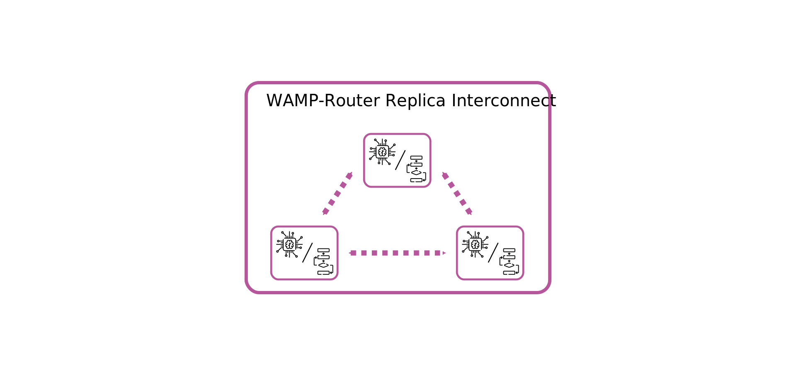

# Prototyp eines verteilten Cloud-Native WAMP-Routers
## Wissenschaftliches Individualprojekt

<small>
  WAMP-Logo by
  <a href="http://crossbario.com/"
     title="Crossbar.io Technologies GmbH">Crossbar.io Technologies GmbH</a>
  is licensed under
  <a href="http://creativecommons.org/licenses/by-sa/3.0/"
     title="Creative Commons BY-SA 3.0">CC BY-SA 3.0</a>
</small>

----

# I. Introduction
## What is WAMP?

<small>
  Icons made by
  <a href="https://www.flaticon.com/authors/freepik" title="Freepik">Freepik</a>,
  <a href="https://www.flaticon.com/authors/smashicons" title="Smashicons">Smashicons</a>
  from
  <a href="https://www.flaticon.com/" title="Flaticon">www.flaticon.com</a>
  are licensed by
  <a href="http://creativecommons.org/licenses/by/3.0/" title="Creative Commons BY 3.0">CC 3.0 BY</a>
</small>

----

# II. Limitations of WAMP
## Centralized routing

<small>
  Icons made by
  <a href="https://www.flaticon.com/authors/freepik" title="Freepik">Freepik</a>,
  <a href="https://www.flaticon.com/authors/smashicons" title="Smashicons">Smashicons</a>
  from
  <a href="https://www.flaticon.com/" title="Flaticon">www.flaticon.com</a>
  are licensed by
  <a href="http://creativecommons.org/licenses/by/3.0/" title="Creative Commons BY 3.0">CC 3.0 BY</a>
</small>

----

# III. A Decentralized WAMP Router
## State of a WAMP Router

<small>
  Icons made by
  <a href="https://www.flaticon.com/authors/freepik" title="Freepik">Freepik</a>,
  <a href="https://www.flaticon.com/authors/smashicons" title="Smashicons">Smashicons</a>
  from
  <a href="https://www.flaticon.com/" title="Flaticon">www.flaticon.com</a>
  are licensed by
  <a href="http://creativecommons.org/licenses/by/3.0/" title="Creative Commons BY 3.0">CC 3.0 BY</a>
</small>

----

# IV. Background
## Sharing State

<small>
  Icons made by
  <a href="https://www.flaticon.com/authors/freepik" title="Freepik">Freepik</a>,
  <a href="https://www.flaticon.com/authors/smashicons" title="Smashicons">Smashicons</a>,
  <a href="https://www.flaticon.com/authors/prettycons" title="prettycons">prettycons</a>
  from
  <a href="https://www.flaticon.com/" title="Flaticon">www.flaticon.com</a>
  are licensed by
  <a href="http://creativecommons.org/licenses/by/3.0/" title="Creative Commons BY 3.0">CC 3.0 BY</a>
</small>

----

# V. Solution Concept
## Replica Communication / Databases and Filesystems

<small>
  Icons made by
  <a href="https://www.flaticon.com/authors/freepik" title="Freepik">Freepik</a>,
  <a href="https://www.flaticon.com/authors/smashicons" title="Smashicons">Smashicons</a>,
  <a href="https://www.flaticon.com/authors/prettycons" title="prettycons">prettycons</a>
  from
  <a href="https://www.flaticon.com/" title="Flaticon">www.flaticon.com</a>
  are licensed by
  <a href="http://creativecommons.org/licenses/by/3.0/" title="Creative Commons BY 3.0">CC 3.0 BY</a>
</small>

----

# V. Solution Concept
## Replica Communication / Consensus Algorithm

<small>
  Icons made by
  <a href="https://www.flaticon.com/authors/freepik" title="Freepik">Freepik</a>
  from
  <a href="https://www.flaticon.com/" title="Flaticon">www.flaticon.com</a>
  are licensed by
  <a href="http://creativecommons.org/licenses/by/3.0/" title="Creative Commons BY 3.0">CC 3.0 BY</a>
</small>

---

# Implementing A Distributed WAMP-Router
## Developing the Autobahnkreuz WAMP-Router

----

# VI. Implementing A Distributed WAMP-Router
## Connection Management

<small>
  Icons made by
  <a href="https://www.flaticon.com/authors/freepik" title="Freepik">Freepik</a>
  from
  <a href="https://www.flaticon.com/" title="Flaticon">www.flaticon.com</a>
  are licensed by
  <a href="http://creativecommons.org/licenses/by/3.0/" title="Creative Commons BY 3.0">CC 3.0 BY</a>
</small>

----

# VI. Implementing A Distributed WAMP-Router
## State Management

<small>
  Icons made by
  <a href="https://www.flaticon.com/authors/freepik" title="Freepik">Freepik</a>
  from
  <a href="https://www.flaticon.com/" title="Flaticon">www.flaticon.com</a>
  are licensed by
  <a href="http://creativecommons.org/licenses/by/3.0/" title="Creative Commons BY 3.0">CC 3.0 BY</a>
</small>

----

# VI. Implementing A Distributed WAMP-Router
## Storing State

<small>
  Icons made by
  <a href="https://www.flaticon.com/authors/freepik" title="Freepik">Freepik</a>
  from
  <a href="https://www.flaticon.com/" title="Flaticon">www.flaticon.com</a>
  are licensed by
  <a href="http://creativecommons.org/licenses/by/3.0/" title="Creative Commons BY 3.0">CC 3.0 BY</a>
</small>

----

# VI. Implementing A Distributed WAMP-Router
## Running a Node

<small>
  Icons made by
  <a href="https://www.flaticon.com/authors/freepik" title="Freepik">Freepik</a>
  from
  <a href="https://www.flaticon.com/" title="Flaticon">www.flaticon.com</a>
  are licensed by
  <a href="http://creativecommons.org/licenses/by/3.0/" title="Creative Commons BY 3.0">CC 3.0 BY</a>
</small>

----

# VI. Implementing A Distributed WAMP-Router
## Implementing the Router

<small>
  Icons made by
  <a href="https://www.flaticon.com/authors/freepik" title="Freepik">Freepik</a>
  from
  <a href="https://www.flaticon.com/" title="Flaticon">www.flaticon.com</a>
  are licensed by
  <a href="http://creativecommons.org/licenses/by/3.0/" title="Creative Commons BY 3.0">CC 3.0 BY</a>
</small>

---

# Validation
## Measuring the Performance of Autobahnkreuz

----

# VII. Validation
## Test Setup

> TODO: Add image

----

# VII. Validation
## Results

  
  
  
  

----

# Conclusion and Future Work

> TODO
